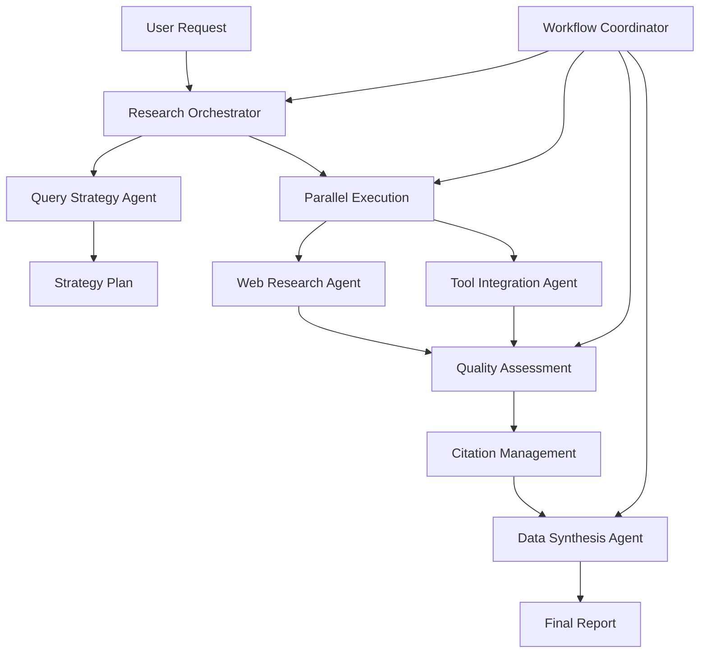

# 🔬 Research Engineering Workflow - Multi-Agent Orchestration Plan

## 📋 System Overview

This orchestration plan transforms the research engineering workflow into a coordinated multi-agent Pydantic AI system capable of parallel research execution, intelligent coordination, and comprehensive information synthesis.

**Core Mission**: Automate complex research tasks through intelligent agent coordination, supporting multiple research strategies while maintaining high-quality source attribution and fact verification.

---

## 📊 GitHub Issues Reference

The following GitHub issues have been created for parallel agent development:

| Issue # | Agent Name | Description | Priority | Status |
|---------|------------|-------------|----------|--------|
| [#1](https://github.com/hugoganet/pydantic_agent_factory_with_subagent/issues/1) | Research Orchestrator Agent | Master coordinator for research strategy and task distribution | HIGH | Open |
| [#2](https://github.com/hugoganet/pydantic_agent_factory_with_subagent/issues/2) | Web Research Agent | Specialized web search and information gathering | HIGH | Open |
| [#3](https://github.com/hugoganet/pydantic_agent_factory_with_subagent/issues/3) | Tool Integration Agent | Internal systems and API interface | MEDIUM | Open |
| [#4](https://github.com/hugoganet/pydantic_agent_factory_with_subagent/issues/4) | Quality Assessment Agent | Source credibility and fact verification | HIGH | Open |
| [#5](https://github.com/hugoganet/pydantic_agent_factory_with_subagent/issues/5) | Citation Management Agent | Source attribution and reference formatting | MEDIUM | Open |
| [#6](https://github.com/hugoganet/pydantic_agent_factory_with_subagent/issues/6) | Query Strategy Agent | Research approach optimization | MEDIUM | Open |
| [#7](https://github.com/hugoganet/pydantic_agent_factory_with_subagent/issues/7) | Data Synthesis Agent | Information integration and report generation | HIGH | Open |
| [#8](https://github.com/hugoganet/pydantic_agent_factory_with_subagent/issues/8) | Workflow Coordinator Agent | System orchestration and health monitoring | HIGH | Open |

### Git Worktrees Created

Each agent has a dedicated git worktree for parallel development:
- `../issue-1-research-orchestrator` - Branch: issue-1-research-orchestrator
- `../issue-2-web-research` - Branch: issue-2-web-research
- `../issue-3-tool-integration` - Branch: issue-3-tool-integration
- `../issue-4-quality-assessment` - Branch: issue-4-quality-assessment
- `../issue-5-citation-management` - Branch: issue-5-citation-management
- `../issue-6-query-strategy` - Branch: issue-6-query-strategy
- `../issue-7-data-synthesis` - Branch: issue-7-data-synthesis
- `../issue-8-workflow-coordinator` - Branch: issue-8-workflow-coordinator

---

## 🎯 Agent Architecture & Dependencies

### Primary Agents

#### 1. 🎼 Research Orchestrator Agent
- **Role**: Master coordinator for research strategy and task distribution
- **Responsibilities**:
  - Parse complex research requests into actionable subtasks
  - Determine optimal research strategy (depth-first, breadth-first, targeted)
  - Coordinate parallel agent execution
  - Synthesize final research outputs
- **Dependencies**: ALL other agents
- **Input**: User research request, research parameters
- **Output**: Comprehensive research report with citations

#### 2. 🌐 Web Research Agent
- **Role**: Specialized web search and information gathering
- **Responsibilities**:
  - Execute web searches using multiple search engines
  - Extract and clean content from web sources
  - Evaluate source credibility and relevance
  - Handle rate limiting and search optimization
- **Dependencies**: Quality Assessment Agent, Citation Management Agent
- **Input**: Search queries, source quality requirements
- **Output**: Structured research data with metadata

#### 3. 🔧 Tool Integration Agent
- **Role**: Interface with internal tools and external APIs
- **Responsibilities**:
  - Google Drive document access and search
  - Gmail content analysis and extraction
  - Slack workspace search and communication
  - CRM/database query execution
- **Dependencies**: Quality Assessment Agent
- **Input**: Tool-specific queries and parameters
- **Output**: Structured internal data with source attribution

#### 4. ✅ Quality Assessment Agent
- **Role**: Source quality evaluation and fact verification
- **Responsibilities**:
  - Evaluate source credibility and authority
  - Cross-reference facts across multiple sources
  - Detect potential misinformation or bias
  - Score research quality and confidence levels
- **Dependencies**: None (foundational service)
- **Input**: Raw research data and sources
- **Output**: Quality scores, verification status, confidence ratings

#### 5. 📚 Citation Management Agent
- **Role**: Source attribution and reference formatting
- **Responsibilities**:
  - Generate proper citations in multiple formats (APA, MLA, Chicago)
  - Track source lineage and attribution chains
  - Manage duplicate source detection
  - Create bibliography and reference lists
- **Dependencies**: None (foundational service)
- **Input**: Source metadata and content references
- **Output**: Formatted citations and reference management

#### 6. 🧭 Query Strategy Agent
- **Role**: Research approach optimization
- **Responsibilities**:
  - Analyze research requests for complexity and scope
  - Recommend optimal search strategies
  - Adapt approach based on preliminary results
  - Balance depth vs breadth based on requirements
- **Dependencies**: None (advisory service)
- **Input**: Research objectives and constraints
- **Output**: Optimized research strategy and execution plan

#### 7. 🧩 Data Synthesis Agent
- **Role**: Information integration and report generation
- **Responsibilities**:
  - Combine research from multiple sources and agents
  - Identify patterns, gaps, and contradictions
  - Generate coherent narrative from disparate sources
  - Create executive summaries and detailed reports
- **Dependencies**: All research agents
- **Input**: Multi-source research data and findings
- **Output**: Synthesized reports, summaries, insights

#### 8. 🎪 Workflow Coordinator Agent
- **Role**: System orchestration and dependency verification
- **Responsibilities**:
  - Monitor agent health and performance
  - Handle inter-agent communication and data flow
  - Manage parallel execution and synchronization
  - Provide system status and progress tracking
- **Dependencies**: All agents (monitoring role)
- **Input**: System status, agent outputs, workflow state
- **Output**: Coordination signals, status reports, error handling

---

## 🔄 Data Flow Architecture

### Research Execution Pipeline



### Coordination Patterns

#### 1. **Sequential Dependencies**
- Query Strategy → Research Orchestrator → Parallel Execution
- Quality Assessment → Citation Management → Data Synthesis

#### 2. **Parallel Execution Groups**
- **Research Group**: Web Research + Tool Integration (parallel)
- **Processing Group**: Quality Assessment + Citation Management (can overlap)
- **Coordination Group**: Workflow Coordinator (monitors all)

#### 3. **Feedback Loops**
- Quality Assessment → Research agents (refinement requests)
- Data Synthesis → Research Orchestrator (gap identification)
- Workflow Coordinator → All agents (performance optimization)

---

## 🛠️ Integration Protocols

### Inter-Agent Communication

#### Message Format Standard
```python
from pydantic import BaseModel
from typing import Dict, Any, List, Optional
from datetime import datetime

class AgentMessage(BaseModel):
    sender_id: str
    recipient_id: str
    message_type: str  # "task", "result", "status", "error"
    payload: Dict[str, Any]
    timestamp: datetime
    correlation_id: str
    priority: int = 1

class ResearchTask(BaseModel):
    task_id: str
    research_query: str
    strategy: str  # "depth_first", "breadth_first", "targeted"
    constraints: Dict[str, Any]
    quality_requirements: Dict[str, Any]
    deadline: Optional[datetime]
```

#### Data Models

```python
class ResearchSource(BaseModel):
    source_id: str
    url: Optional[str]
    title: str
    content: str
    metadata: Dict[str, Any]
    quality_score: float
    confidence_rating: float
    extraction_timestamp: datetime

class ResearchFindings(BaseModel):
    query_id: str
    sources: List[ResearchSource]
    summary: str
    key_insights: List[str]
    gaps_identified: List[str]
    confidence_overall: float
    citations: List[str]
```

---

## 🚀 Parallel Execution Strategy

### Phase 1: Research Planning (Sequential)
1. **Research Orchestrator** receives user request
2. **Query Strategy Agent** analyzes and recommends approach
3. **Research Orchestrator** creates execution plan

### Phase 2: Information Gathering (Parallel)
1. **Web Research Agent** executes web searches
2. **Tool Integration Agent** queries internal systems
3. **Workflow Coordinator** monitors progress

### Phase 3: Quality Processing (Pipeline)
1. **Quality Assessment Agent** evaluates all sources
2. **Citation Management Agent** processes attributions
3. Results flow to synthesis phase

### Phase 4: Synthesis & Reporting (Sequential)
1. **Data Synthesis Agent** combines all findings
2. **Research Orchestrator** compiles final report
3. **Workflow Coordinator** validates completeness

---

## 📋 GitHub Issues for Agent Development

### Issue Template Structure
Each agent will have a dedicated GitHub issue following this format:

```markdown
# [Agent Name] - Pydantic AI Implementation

## Agent Specification
- **Primary Role**: [Core responsibility]
- **Dependencies**: [List of dependent agents]
- **Input Models**: [Pydantic models for inputs]
- **Output Models**: [Pydantic models for outputs]

## Technical Requirements
- Pydantic AI framework integration
- Async/await support for parallel execution
- Comprehensive error handling and retries
- Integration with message passing system
- Full test coverage with TestModel/FunctionModel

## Success Criteria
- [ ] Agent responds to standard message format
- [ ] Handles all specified input types
- [ ] Produces properly formatted outputs
- [ ] Integrates with coordination system
- [ ] Passes all validation tests

## Reference Implementation
Follow patterns from: `/research_engineering_workflow/CLAUDE.md`
```

---

## 🔐 Environment Configuration

### Required API Keys and Services
```env
# Search APIs
BRAVE_API_KEY=your_brave_search_api_key
GOOGLE_SEARCH_API_KEY=your_google_api_key
GOOGLE_SEARCH_ENGINE_ID=your_search_engine_id

# LLM Providers
OPENAI_API_KEY=your_openai_key
ANTHROPIC_API_KEY=your_anthropic_key

# Tool Integrations
GOOGLE_DRIVE_CREDENTIALS_PATH=path/to/credentials.json
GMAIL_API_CREDENTIALS=your_gmail_credentials
SLACK_BOT_TOKEN=your_slack_bot_token

# Quality Assessment Services
FACT_CHECK_API_KEY=your_fact_check_api
CREDIBILITY_SERVICE_KEY=your_credibility_service

# System Configuration
REDIS_URL=redis://localhost:6379  # For inter-agent messaging
DATABASE_URL=sqlite:///research_workflow.db
LOG_LEVEL=INFO
MAX_PARALLEL_AGENTS=5
```

---

## ✅ Validation & Testing Framework

### Integration Testing Strategy
1. **Unit Tests**: Each agent tested in isolation with TestModel
2. **Integration Tests**: Agent-to-agent communication validation
3. **End-to-End Tests**: Complete workflow execution tests
4. **Performance Tests**: Parallel execution and timing validation
5. **Quality Tests**: Research output accuracy and citation validation

### Validation Checkpoints
- [ ] All agents respond to coordination messages
- [ ] Parallel execution maintains data integrity
- [ ] Quality assessment produces consistent scores
- [ ] Citation management handles all source types
- [ ] Synthesis generates coherent reports
- [ ] Error handling and recovery works across all agents

---

## 📈 Success Metrics

### Performance Targets
- **Research Completion Time**: <10 minutes for standard queries
- **Source Quality Score**: >0.8 average across all sources
- **Citation Accuracy**: 100% properly formatted citations
- **Parallel Efficiency**: >80% time savings vs sequential execution
- **Error Rate**: <5% for standard research workflows

### Quality Measures
- Source credibility verification accuracy
- Fact-checking precision and recall
- Report coherence and completeness
- User satisfaction with research depth

---

## 🛡️ Security & Privacy Considerations

### Data Handling
- All API keys managed through environment variables
- Temporary data encrypted at rest and in transit
- Source attribution maintains privacy compliance
- Audit logging for all inter-agent communications

### Access Control
- Agent-specific permission scopes
- Rate limiting for external API calls
- Secure credential management for tool integrations
- Privacy filtering for sensitive information

---

## 🔄 Deployment & Scaling

### Containerization Strategy
Each agent deployed as separate container for:
- Independent scaling based on workload
- Fault isolation and recovery
- Rolling updates without system downtime
- Resource optimization per agent type

### Orchestration Platform
- Kubernetes for container orchestration
- Redis for inter-agent messaging
- PostgreSQL for persistent research storage
- Monitoring with Prometheus and Grafana

---

This orchestration plan provides the complete framework for transforming the research engineering workflow into a sophisticated multi-agent Pydantic AI system with parallel execution, intelligent coordination, and comprehensive quality assurance.