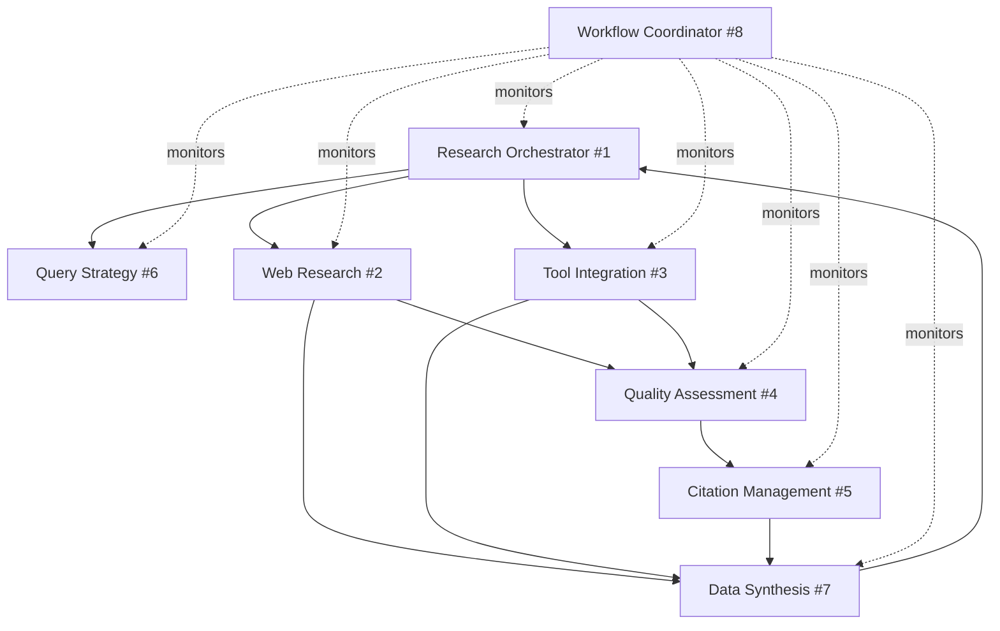

# 🔬 Research Engineering Workflow Architecture

## 📋 Executive Summary

This document serves as the central architectural reference for the Research Engineering Multi-Agent Workflow system. It provides comprehensive documentation for parallel Pydantic AI agent development, ensuring all developers understand the system architecture, dependencies, and integration protocols.

---

## 🎯 System Overview

### Core Mission
Automate complex research tasks through intelligent agent coordination, supporting multiple research strategies while maintaining high-quality source attribution and fact verification.

### Key Capabilities
- **Parallel Research Execution**: Multiple agents working simultaneously on different aspects
- **Intelligent Coordination**: Smart task distribution based on query complexity
- **Quality Assurance**: Built-in fact verification and source credibility assessment
- **Flexible Integration**: Support for web search, internal tools, and APIs
- **Comprehensive Reporting**: Automated synthesis and citation management

---

## 📊 GitHub Issues & Development Tracking

### Active Development Issues

| Issue | Agent | Description | Priority | Branch | Worktree |
|-------|-------|-------------|----------|---------|----------|
| [#1](https://github.com/hugoganet/pydantic_agent_factory_with_subagent/issues/1) | Research Orchestrator | Master coordinator for research strategy | HIGH | `issue-1-research-orchestrator` | `../issue-1-research-orchestrator` |
| [#2](https://github.com/hugoganet/pydantic_agent_factory_with_subagent/issues/2) | Web Research | Specialized web search and extraction | HIGH | `issue-2-web-research` | `../issue-2-web-research` |
| [#3](https://github.com/hugoganet/pydantic_agent_factory_with_subagent/issues/3) | Tool Integration | Internal systems and API interface | MEDIUM | `issue-3-tool-integration` | `../issue-3-tool-integration` |
| [#4](https://github.com/hugoganet/pydantic_agent_factory_with_subagent/issues/4) | Quality Assessment | Source credibility verification | HIGH | `issue-4-quality-assessment` | `../issue-4-quality-assessment` |
| [#5](https://github.com/hugoganet/pydantic_agent_factory_with_subagent/issues/5) | Citation Management | Reference formatting and attribution | MEDIUM | `issue-5-citation-management` | `../issue-5-citation-management` |
| [#6](https://github.com/hugoganet/pydantic_agent_factory_with_subagent/issues/6) | Query Strategy | Research approach optimization | MEDIUM | `issue-6-query-strategy` | `../issue-6-query-strategy` |
| [#7](https://github.com/hugoganet/pydantic_agent_factory_with_subagent/issues/7) | Data Synthesis | Information integration and reporting | HIGH | `issue-7-data-synthesis` | `../issue-7-data-synthesis` |
| [#8](https://github.com/hugoganet/pydantic_agent_factory_with_subagent/issues/8) | Workflow Coordinator | System orchestration and monitoring | HIGH | `issue-8-workflow-coordinator` | `../issue-8-workflow-coordinator` |

### Development Environment Setup

```bash
# Quick setup for all worktrees (already completed)
git worktree add ../issue-1-research-orchestrator -b issue-1-research-orchestrator
git worktree add ../issue-2-web-research -b issue-2-web-research
git worktree add ../issue-3-tool-integration -b issue-3-tool-integration
git worktree add ../issue-4-quality-assessment -b issue-4-quality-assessment
git worktree add ../issue-5-citation-management -b issue-5-citation-management
git worktree add ../issue-6-query-strategy -b issue-6-query-strategy
git worktree add ../issue-7-data-synthesis -b issue-7-data-synthesis
git worktree add ../issue-8-workflow-coordinator -b issue-8-workflow-coordinator

# Launch terminal sessions (Warp or default terminal)
for dir in ../issue-{1..8}-*; do open -a Warp "$dir"; done
```

---

## 🔄 Agent Dependency Matrix

### Execution Dependencies



### Dependency Types

| Agent | Depends On | Provides To | Communication Type |
|-------|------------|-------------|-------------------|
| Research Orchestrator | Query Strategy | All Agents | Command & Control |
| Web Research | None | Quality Assessment, Data Synthesis | Data Pipeline |
| Tool Integration | None | Quality Assessment, Data Synthesis | Data Pipeline |
| Quality Assessment | None | Citation Management, Data Synthesis | Quality Metrics |
| Citation Management | None | Data Synthesis | Formatted Citations |
| Query Strategy | None | Research Orchestrator | Strategy Recommendations |
| Data Synthesis | Multiple Sources | Research Orchestrator | Final Reports |
| Workflow Coordinator | None (Monitor) | All Agents | Health & Status |

---

## 💬 Inter-Agent Communication Protocol

### Standard Message Format

```python
from pydantic import BaseModel
from typing import Dict, Any, Optional
from datetime import datetime

class AgentMessage(BaseModel):
    """Standard inter-agent communication format"""
    message_id: str
    sender_id: str
    recipient_id: str
    message_type: Literal["task", "result", "status", "error", "health"]
    payload: Dict[str, Any]
    timestamp: datetime
    correlation_id: str
    priority: int = 1
    retry_count: int = 0

class TaskAssignment(BaseModel):
    """Task assignment from orchestrator to agents"""
    task_id: str
    agent_id: str
    operation: str
    parameters: Dict[str, Any]
    deadline: Optional[datetime]
    dependencies: List[str] = []
    quality_requirements: Dict[str, float] = {}
```

### Message Flow Examples

#### 1. Research Request Flow
```
User → Research Orchestrator → Query Strategy → Research Orchestrator
                             → Web Research → Quality Assessment → Citation Management
                             → Tool Integration → Quality Assessment → Data Synthesis
                                                                    → Research Orchestrator → User
```

#### 2. Health Check Flow
```
Workflow Coordinator → [All Agents] → Status Response → Workflow Coordinator
```

---

## 🚀 Parallel Execution Strategy

### Phase-Based Execution

| Phase | Agents | Execution Type | Duration | Dependencies |
|-------|--------|---------------|----------|--------------|
| **Phase 1: Planning** | Query Strategy | Sequential | 30s | User Request |
| **Phase 2: Research** | Web Research, Tool Integration | Parallel | 2-3 min | Strategy Plan |
| **Phase 3: Assessment** | Quality Assessment | Pipeline | 1 min | Research Results |
| **Phase 4: Attribution** | Citation Management | Sequential | 30s | Quality Scores |
| **Phase 5: Synthesis** | Data Synthesis | Sequential | 1-2 min | All Results |
| **Phase 6: Delivery** | Research Orchestrator | Sequential | 30s | Final Report |

### Parallelization Opportunities

- **Maximum Parallel Agents**: 5 (during Phase 2)
- **Pipeline Processing**: Quality Assessment → Citation Management
- **Async Operations**: All web requests and API calls
- **Batch Processing**: Multiple sources processed simultaneously

---

## 🔐 Environment Configuration

### Required Environment Variables

```bash
# Create .env file in each agent worktree
cat > .env << EOF
# LLM Configuration
OPENAI_API_KEY=your_openai_key
ANTHROPIC_API_KEY=your_anthropic_key

# Search APIs
BRAVE_API_KEY=your_brave_api_key
GOOGLE_SEARCH_API_KEY=your_google_api_key
GOOGLE_SEARCH_ENGINE_ID=your_search_engine_id

# Tool Integrations
GOOGLE_DRIVE_CREDENTIALS_PATH=path/to/credentials.json
GMAIL_API_CREDENTIALS=your_gmail_credentials
SLACK_BOT_TOKEN=your_slack_bot_token

# Infrastructure
REDIS_URL=redis://localhost:6379
DATABASE_URL=sqlite:///research_workflow.db

# System Configuration
MAX_PARALLEL_AGENTS=5
LOG_LEVEL=INFO
EOF
```

---

## ✅ Development Guidelines

### For Each Agent Developer

1. **Start Here**: Read your GitHub issue for detailed specifications
2. **Check Dependencies**: Review the dependency matrix above
3. **Follow Standards**: Implement according to root CLAUDE.md guidelines
4. **Use Standard Protocols**: Implement the message format defined above
5. **Test Isolation**: Use TestModel/FunctionModel for dependency mocking
6. **Document APIs**: Create clear interface documentation
7. **Validate Integration**: Test with mock agents before integration

### Code Structure Template

```
agents/
└── [agent_name]/
    ├── agent.py           # Main Pydantic AI agent
    ├── models.py          # Pydantic models for I/O
    ├── tools.py           # Agent-specific tools
    ├── dependencies.py    # External dependencies
    ├── settings.py        # Configuration management
    ├── requirements.txt   # Python dependencies
    ├── .env.example       # Environment template
    ├── README.md          # Agent documentation
    └── tests/
        ├── test_agent.py
        ├── test_integration.py
        └── conftest.py
```

---

## 📈 Success Metrics

### System-Wide Targets
- **Research Completion**: <10 minutes for standard queries
- **Source Quality**: >0.8 average credibility score
- **Citation Accuracy**: 100% properly formatted
- **Parallel Efficiency**: >80% time savings vs sequential
- **System Uptime**: >99.5% availability

### Per-Agent Metrics
- **Response Time**: <2 seconds for health checks
- **Task Success Rate**: >95% completion
- **Error Recovery**: Automatic retry with backoff
- **Resource Usage**: <500MB memory per agent
- **Test Coverage**: >90% code coverage

---

## 🔄 Integration Testing Strategy

### Test Levels

1. **Unit Tests** (Per Agent)
   - Test agent in isolation with TestModel
   - Validate input/output models
   - Test error handling

2. **Integration Tests** (Agent Pairs)
   - Test message passing between agents
   - Validate data transformation
   - Test error propagation

3. **End-to-End Tests** (Complete Workflow)
   - Full workflow execution
   - Performance benchmarks
   - Quality validation

### Test Execution

```bash
# Run tests for individual agent
cd ../issue-1-research-orchestrator
pytest tests/ -v --cov=agents/research_orchestrator

# Run integration tests
cd /path/to/main/repo
pytest tests/integration/ -v

# Run end-to-end tests
pytest tests/e2e/ -v --benchmark
```

---

## 🚢 Deployment Strategy

### Development → Staging → Production

1. **Development** (Local Worktrees)
   - Individual agent development
   - Unit testing with TestModel
   - Local integration testing

2. **Staging** (Docker Compose)
   - Multi-agent integration
   - Performance testing
   - Quality gate validation

3. **Production** (Kubernetes)
   - Container orchestration
   - Auto-scaling
   - Monitoring & alerting

---

## 📚 Additional Resources

- **Main Documentation**: `/research_engineering_workflow/CLAUDE.md`
- **GitHub Issues**: `/research_engineering_workflow/github_issues.md`
- **Validation Framework**: `/research_engineering_workflow/validation_framework.md`
- **Root Guidelines**: `/CLAUDE.md` (factory workflow)

---

## 🎯 Quick Start for Developers

1. **Find Your Issue**: Check the table above for your assigned agent
2. **Switch to Worktree**: `cd ../issue-{number}-{agent-name}`
3. **Read Architecture**: Review this document for system context
4. **Check Dependencies**: Understand what your agent depends on/provides
5. **Start Development**: Follow the Pydantic AI factory workflow from root CLAUDE.md
6. **Test Thoroughly**: Use provided test frameworks
7. **Integrate Carefully**: Coordinate with dependent agent developers

---

This architecture document is the single source of truth for the Research Engineering Workflow system. All developers should reference this document to understand their role in the larger system and ensure proper integration with other agents.